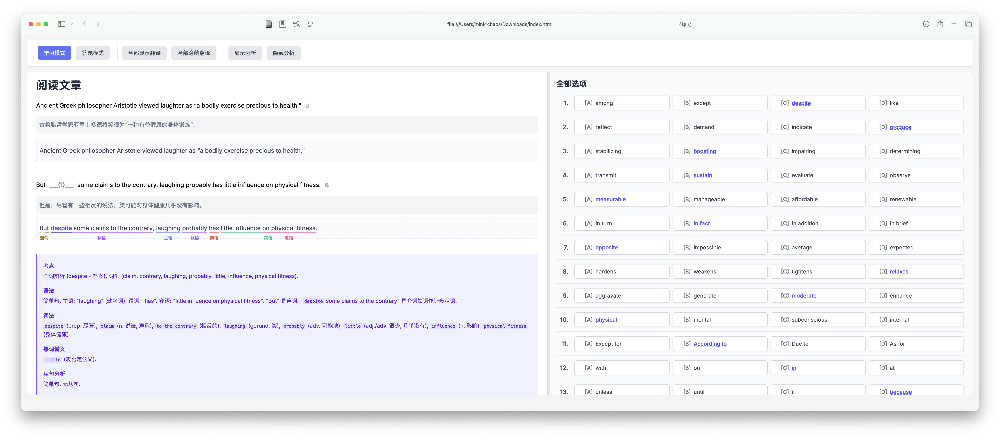
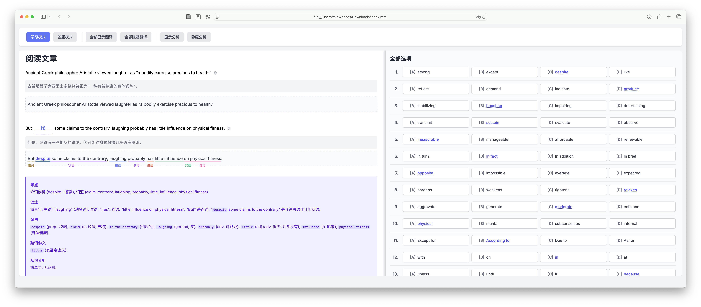
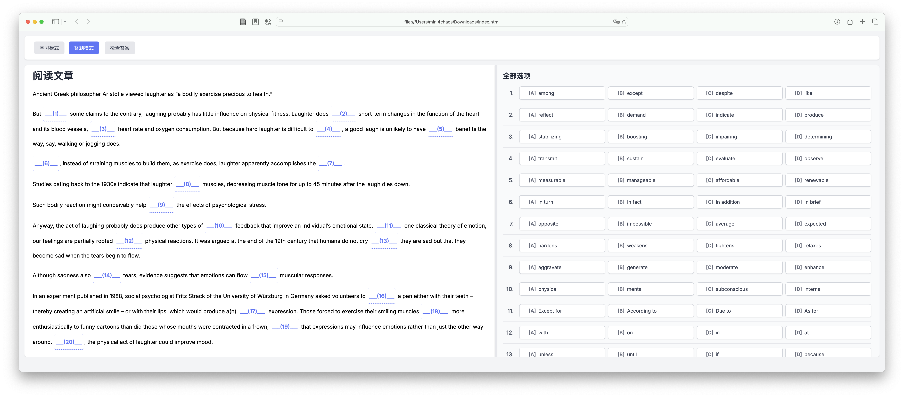
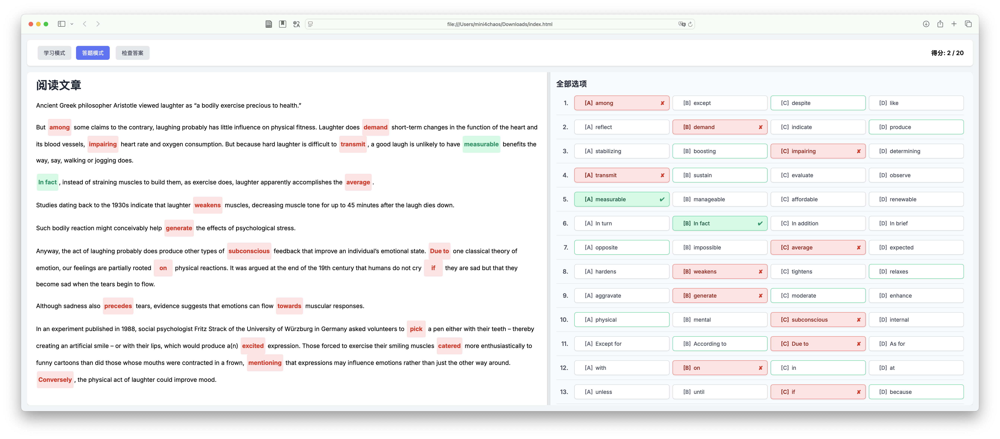

# Usage
打开 `index.html`

提示词: 复制完形填空的考题, 让他按照 2016.js的格式给出解答该阅读题, 给出可能的考点, 词汇, 熟词僻义, 生词词组翻译, 句子翻译, 语法, 词法, 从句分析, 使用给出的文件格式, 提供对应格式的内容

可以自行生成自己需要的年份的完形题目, 阅读等其他题型也可以用相似的方法生成.

保存 `.js` 文件并替换 `index.html` 中的内容即可做题.
```
<script src="2011.js"></script>
```




